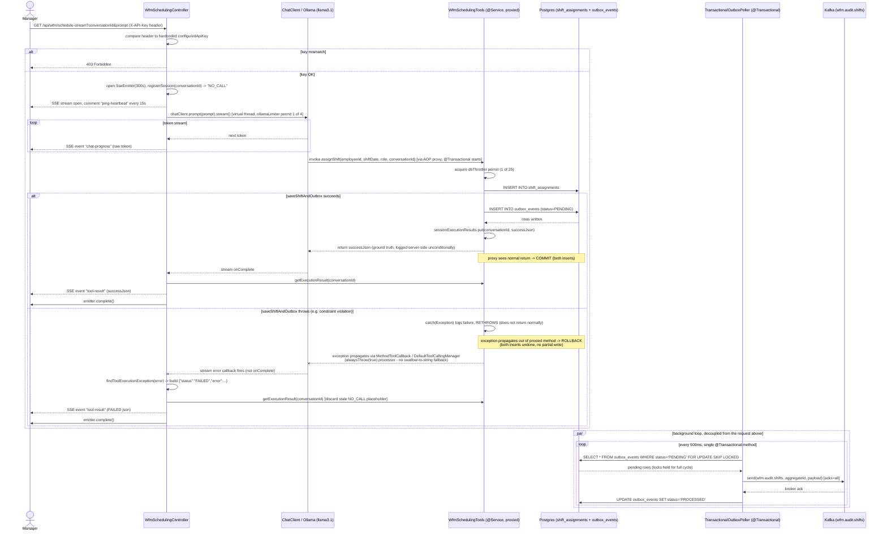
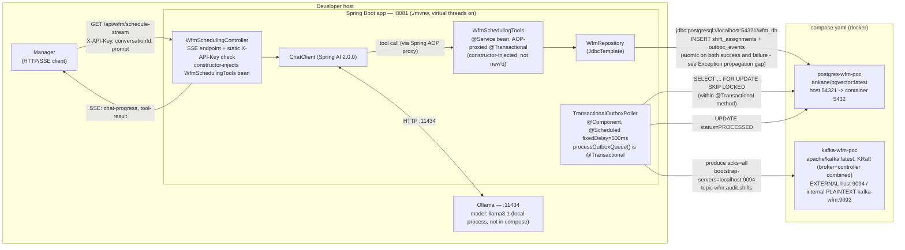

# Architecture — as implemented

This document reflects the code actually present in this repo as of 2026-07-04
(post transactional-proxy fix and exception-propagation fix, `mvn clean
install` green — see [STATE.md](STATE.md)). It is not a description of SPEC.md's aspirational
design; every element below was confirmed by reading
[WfmSchedulingController.java](../src/main/java/com/wfm/poc/controller/WfmSchedulingController.java),
[WfmSchedulingTools.java](../src/main/java/com/wfm/poc/tool/WfmSchedulingTools.java),
[WfmRepository.java](../src/main/java/com/wfm/poc/repository/WfmRepository.java),
[TransactionalOutboxPoller.java](../src/main/java/com/wfm/poc/outbox/TransactionalOutboxPoller.java),
[application.properties](../src/main/resources/application.properties), and
[compose.yaml](../compose.yaml).

## Proxy-bypass bugs — found and fixed

A prior version of this document flagged two bugs where the transactional
boundary wasn't real:
- `WfmSchedulingTools` was constructed with plain `new`, bypassing the Spring
  AOP proxy that `@Transactional` depends on.
- `TransactionalOutboxPoller.processOutboxQueue()` had no `@Transactional` at
  all, so its row lock didn't span the full poll cycle.

Both are fixed in the current code: `WfmSchedulingTools` is now `@Service`
and constructor-injected into the controller as a real Spring bean, and
`processOutboxQueue()` now carries `@Transactional`. A follow-up audit
confirmed no other manual-instantiation-bypasses-proxy instances exist in
the codebase. See STATE.md's "Transactional bug fix" and "AOP proxy audit"
sections for the full detail, including the grep methodology used to rule
out further instances.

## Exception propagation gap — found and fixed

A prior version of this document flagged an open gap: `assignShift`'s
`try { ... } catch (Exception e) { ...; return errorJson; }` swallowed
exceptions instead of rethrowing them, so Spring's `@Transactional` proxy
always saw a "successful" invocation and committed — including any partial
write made before the failure. A live failure-injection test at the time
confirmed this: a thrown exception between the two inserts left a committed
`shift_assignments` row with no matching `outbox_events` row.

This is now fixed, via two changes that were both necessary:
- `WfmSchedulingTools.assignShift`'s catch block no longer builds an
  `errorJson` string and returns it. It logs the failure (unconditionally,
  per SPEC.md's ground-truth-logging requirement) and rethrows — the
  original exception if it's already a `RuntimeException`, otherwise
  wrapped in an `IllegalStateException` — so the exception propagates out
  of the proxied method and the `@Transactional` proxy actually observes
  the failure and rolls back.
- `WfmSchedulingController` explicitly builds a `ToolCallingManager` with
  `DefaultToolExecutionExceptionProcessor.builder().alwaysThrow(true).build()`
  and wires it into `ChatClient.builder(...)` via a `ToolCallingAdvisor`.
  This was required because the controller's `ChatClient` isn't built from
  an autoconfigured `ChatClient.Builder` bean — the 5-arg static factory it
  uses falls back to a fresh `ToolCallingManager` with the library default
  `alwaysThrow=false`, which would otherwise catch the rethrown exception
  and convert it back into a plain string tool-response, silently
  defeating the rethrow fix above.

A failure-injection re-test (documented in STATE.md's "Exception
propagation fix" section) confirmed **zero rows** in both
`shift_assignments` and `outbox_events` after an injected failure — full
atomicity, not partial. See STATE.md for the full detail, including the
`ToolExecutionException`/`ChatClient` API investigation behind the second
change.

## 1. Functional flow (request lifecycle)

A manager opens the SSE endpoint with a static API-key header, a caller-supplied
`conversationId`, and a natural-language `prompt`. The controller streams model
tokens as they arrive, then — once the model's tool call has actually returned —
streams the tool's authoritative JSON as a second, distinct event type, per
`WfmSchedulingController.streamScheduling` and `WfmSchedulingTools.assignShift`.
`WfmSchedulingTools` is a constructor-injected `@Service` bean, so
`@Transactional` on `assignShift` runs through a real AOP proxy. Outbox
publication to Kafka happens on a separate 500ms poll loop
(`TransactionalOutboxPoller.processOutboxQueue`, itself now `@Transactional`),
fully decoupled from the request/response cycle.

## 2. Deployment architecture

Only Postgres and Kafka are containerized in `compose.yaml`; the Spring Boot
app and Ollama both run directly on the host. Postgres and Kafka each publish a
non-default host port to avoid colliding with other local services (per
SPEC.md's hard requirement) — `54321` for Postgres and `9094` for Kafka's
external listener. Kafka runs single-node KRaft mode (combined broker +
controller role, no ZooKeeper), with a separate internal `PLAINTEXT` listener
(`kafka-wfm:9092`) that the app does not use — the app connects only via the
external listener on `localhost:9094`.

