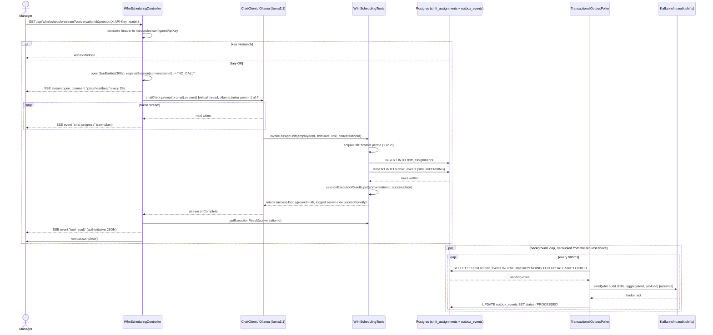
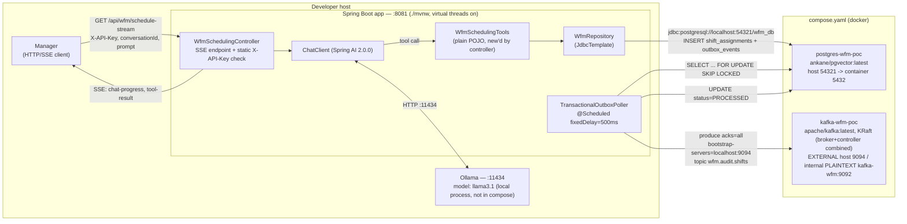

# Architecture — as implemented

This document reflects the code actually present in this repo as of 2026-07-04
(post-cleanup, `mvn clean install` green — see [STATE.md](STATE.md)). It is not
a description of SPEC.md's aspirational design; every element below was
confirmed by reading
[WfmSchedulingController.java](../src/main/java/com/wfm/poc/controller/WfmSchedulingController.java),
[WfmSchedulingTools.java](../src/main/java/com/wfm/poc/tool/WfmSchedulingTools.java),
[WfmRepository.java](../src/main/java/com/wfm/poc/repository/WfmRepository.java),
[TransactionalOutboxPoller.java](../src/main/java/com/wfm/poc/outbox/TransactionalOutboxPoller.java),
[application.properties](../src/main/resources/application.properties), and
[compose.yaml](../compose.yaml).

Two implementation details worth flagging up front because they affect how to
read the diagrams below:
- `WfmSchedulingTools` is constructed with plain `new WfmSchedulingTools(repository)`
  in the controller constructor ([WfmSchedulingController.java:30](../src/main/java/com/wfm/poc/controller/WfmSchedulingController.java#L30)),
  not injected as a Spring bean. Its `@Transactional` annotation on `assignShift`
  is therefore not backed by a Spring AOP proxy — the two inserts in
  `saveShiftAndOutbox` run as two independent auto-committed statements, not a
  single atomic transaction.
- `TransactionalOutboxPoller.processOutboxQueue()` is not itself `@Transactional`;
  its `SELECT ... FOR UPDATE SKIP LOCKED` executes and releases its row lock
  within that single auto-committed statement.

## 1. Functional flow (request lifecycle)

A manager opens the SSE endpoint with a static API-key header, a caller-supplied
`conversationId`, and a natural-language `prompt`. The controller streams model
tokens as they arrive, then — once the model's tool call has actually returned —
streams the tool's authoritative JSON as a second, distinct event type, per
`WfmSchedulingController.streamScheduling` and `WfmSchedulingTools.assignShift`.
Outbox publication to Kafka happens on a separate 500ms poll loop, fully
decoupled from the request/response cycle.

## 2. Deployment architecture

Only Postgres and Kafka are containerized in `compose.yaml`; the Spring Boot
app and Ollama both run directly on the host. Postgres and Kafka each publish a
non-default host port to avoid colliding with other local services (per
SPEC.md's hard requirement) — `54321` for Postgres and `9094` for Kafka's
external listener. Kafka runs single-node KRaft mode (combined broker +
controller role, no ZooKeeper), with a separate internal `PLAINTEXT` listener
(`kafka-wfm:9092`) that the app does not use — the app connects only via the
external listener on `localhost:9094`.

